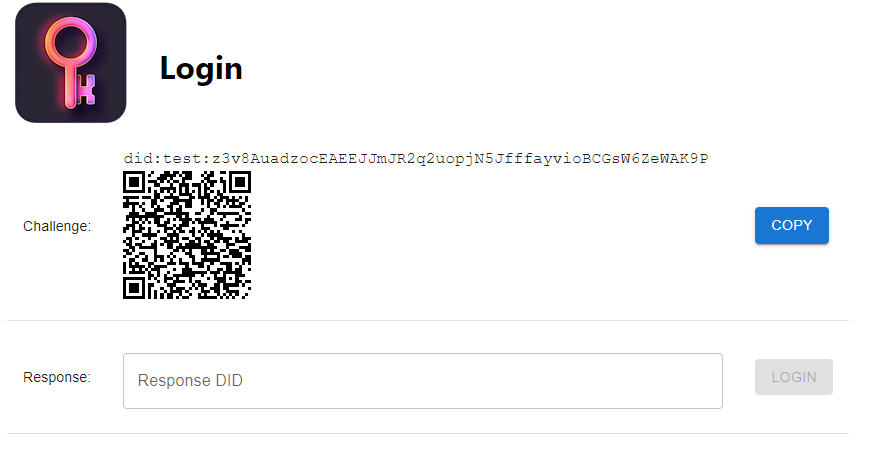

# MDIP Auth Demo

### Overview
This repository hosts a simple authentication demo using MDIP. It is split into two main folders:

- **client/** – A React front-end
- **server/** – An Express/Node back-end

### Running the Demo

You can run the demo in two ways:

1. **Run client and server together** – The server will serve the built React client.
2. **Run client and server separately** – The client dev server communicates via an API URL to the back end.

### Repository Structure

- **client/**  
  A React front-end, with a `.env` controlling its API endpoint and HTTPS dev settings.
- **server/**  
  An Express server that provides `/api` endpoints, using Keymaster for DID-based authentication. Has a .env to set keymaster, Gatekeeper, callback, whether to serve the React client, HTTPS dev settings and CORS for external React app.

### Quick Start

1. **Install** dependencies for both client and server:
  - `npm run install`  

2. **Run** both in parallel:
  - `npm start`  

3. **Visit** the site in a browser:
  - If you’re serving the client from the server, go to `http://localhost:3000`.

### QR code integration



The QR code encodes a URL that includes the challenge DID as a query parameter:

`https://wallet.mdip.yourself.dev?challenge=did:test:z3v8Auak6KesbV1nnMz1XUUMoZcuW4GBKygWNnKHHAQU3N9sDDz`

The wallet URL is specified in an environment variable `AD_WALLET_URL` included in a `.env` file.

The challenge is created with a callback specified in the `AD_CALLBACK_URL` environment variable. This should point to the location where the auth-demo is deployed.

See `sample.env` for example values.

An MDIP wallet installed on a mobile device can scan the QR code and extract the challenge DID from the URL, ignoring the wallet URL preceding the challenge.


The API offers two ways to submit a response to the challenge, GET and POST.

The GET method uses a query parameters for the `response`, e.g.

```
curl https://auth-demo-server:3000/api/login?response=did:test:z3v8AuaUENXcWUdHKpJqozSLyjHg8pjGF7Dd5H8GnKaeLgDuTcG
```

The POST method takes the same parameter in the body of the request:

```
curl -X POST -H "Content-Type: application/json" -d '{"response":"did:test:z3v8AuaUENXcWUdHKpJqozSLyjHg8pjGF7Dd5H8GnKaeLgDuTcG"}' https://localhost:3000/api/login
```

Both login methods return a JSON object indicating whether the login was successful:
```
{ authenticated: [ true | false ] }
```

## Authentication Sequence Diagram

The diagram below details the MDIP Authentication process of a user Alice accessing a 3rd Party Website and authenticating herself using a smart-phone wallet to scan the Challenge QR code from the Website's login page. The diagram demonstrates the 3rd Party Website operator using a hosted Node-as-a-Service MDIP gatekeeper infrastructure provider.


### Further Reading
- **client/README.md** – Explains how to run the React client independently.
- **server/README.md** – Explains how to run the auth server independently.
